# Proyecto 2 de Data Mining 202520

**Mateo Vivanco (00328476)**

### Introducción
Este proyecto implementa un pipeline end-to-end automatizado con Mage AI, transformando los datos del NYC Taxi & Limousine Commission (Yellow y Green) mediante una Arquitectura Medallion. Para ello, se utilizará Docker Compose, donde se ejecuta el servicio de base de datos PostgreSQL, PGAdmin para visualización y control, y MageAI para manejar la arquitectura y procesamiento. Finalmente, se plantea documentar todo el proceso y responer a 20 preguntas de negocio utilizando la arquitectura de capa Gold.

### Descripción y diagrama de arquitectura

```text
[Fuente: NYC TLC Parquet Files] 
       │
       ▼
(Mage Pipeline: ingest_bronze) 
       │
       ▼
[BRONZE LAYER: PostgreSQL] ➔ Tablas raw con metadatos de ingesta (ingest_ts, source_month)
       │
       ▼
(Mage Pipeline: dbt_build_silver) 
       │
       ▼
[SILVER LAYER: Vistas Curadas] ➔ Limpieza, estandarización y filtrado de calidad
       │
       ▼
(Mage Pipeline: dbt_build_gold) 
       │
       ▼
[GOLD LAYER: Modelo Estrella] ➔ Tablas particionadas optimizadas (Hechos y Dimensiones)
       │
       ▼
[Análisis y Reporting] ➔ Jupyter Notebook (data_analysis.ipynb)
```

## Tabla de Cobertura en capa RAW
|year_month|service_type|status|total_count|
|-|-|-|-|
|2022-01|green|loaded|62495|
|2022-01|yellow|loaded|2463931|
|2022-02|green|loaded|69399|
|2022-02|yellow|loaded|2979431|
|2022-03|green|loaded|78537|
|2022-03|yellow|loaded|3627882|
|2022-04|green|loaded|76136|
|2022-04|yellow|loaded|3599920|
|2022-05|green|loaded|76891|
|2022-05|yellow|loaded|3588295|
|2022-06|green|loaded|73718|
|2022-06|yellow|loaded|3558124|
|2022-07|green|loaded|64192|
|2022-07|yellow|loaded|3174394|
|2022-08|green|loaded|65929|
|2022-08|yellow|loaded|3152677|
|2022-09|green|loaded|69031|
|2022-09|yellow|loaded|3183767|
|2022-10|green|loaded|69322|
|2022-10|yellow|loaded|3675411|
|2022-11|green|loaded|62313|
|2022-11|yellow|loaded|3252717|
|2022-12|green|loaded|72439|
|2022-12|yellow|loaded|3399549|
|2023-01|green|loaded|68211|
|2023-01|yellow|loaded|3066766|
|2023-02|green|loaded|64809|
|2023-02|yellow|loaded|2913955|
|2023-03|green|loaded|72044|
|2023-03|yellow|loaded|3403766|
|2023-04|green|loaded|65392|
|2023-04|yellow|loaded|3288250|
|2023-05|green|loaded|69174|
|2023-05|yellow|loaded|3513649|
|2023-06|green|loaded|65550|
|2023-06|yellow|loaded|3307234|
|2023-07|green|loaded|61343|
|2023-07|yellow|loaded|2907108|
|2023-08|green|loaded|60649|
|2023-08|yellow|loaded|2824209|
|2023-09|green|loaded|65471|
|2023-09|yellow|loaded|2846722|
|2023-10|green|loaded|66177|
|2023-10|yellow|loaded|3522285|
|2023-11|green|loaded|64025|
|2023-11|yellow|loaded|3339715|
|2023-12|green|loaded|64215|
|2023-12|yellow|loaded|3376567|
|2024-01|green|loaded|56551|
|2024-01|yellow|loaded|2964624|
|2024-02|green|loaded|53577|
|2024-02|yellow|loaded|3007526|
|2024-03|green|loaded|57457|
|2024-03|yellow|loaded|3582628|
|2024-04|green|loaded|56471|
|2024-04|yellow|loaded|3514289|
|2024-05|green|loaded|61003|
|2024-05|yellow|loaded|3723833|
|2024-06|green|loaded|54748|
|2024-06|yellow|loaded|3539193|
|2024-07|green|loaded|51837|
|2024-07|yellow|loaded|3076903|
|2024-08|green|loaded|51771|
|2024-08|yellow|loaded|2979183|
|2024-09|green|loaded|54440|
|2024-09|yellow|loaded|3633030|
|2024-10|green|loaded|56147|
|2024-10|yellow|loaded|3833771|
|2024-11|green|loaded|52222|
|2024-11|yellow|loaded|3646369|
|2024-12|green|loaded|53994|
|2024-12|yellow|loaded|3668371|
|2025-01|green|loaded|48326|
|2025-01|yellow|loaded|3475226|
|2025-02|green|loaded|46621|
|2025-02|yellow|loaded|3577543|
|2025-03|green|loaded|51539|
|2025-03|yellow|loaded|4145257|
|2025-04|green|loaded|52132|
|2025-04|yellow|loaded|3970553|
|2025-05|green|loaded|55399|
|2025-05|yellow|loaded|4591845|
|2025-06|green|loaded|49390|
|2025-06|yellow|loaded|4322960|
|2025-07|green|loaded|48205|
|2025-07|yellow|loaded|3898963|
|2025-08|green|loaded|46306|
|2025-08|yellow|loaded|3574091|
|2025-09|green|loaded|48893|
|2025-09|yellow|loaded|4251015|
|2025-10|green|loaded|49416|
|2025-10|yellow|loaded|4428699|
|2025-11|green|loaded|46912|
|2025-11|yellow|loaded|4181444|
|2025-12|green|**missing**|0|
|2025-12|yellow|**missing**|0|

Se creó una vista a nivel de capa bronce que reporta estos números automáticamente al momento en que se actualicen las entradas en la tabla de datos de los viajes. Por lo pronto, se puede observar que aún no se encuentran disponibles los datos del mes de Diciembre de 2025 de ninguno de los dos servicios de taxis de New York.

### Levantamiento de la Infraestructura
Para la infraestructura general se utilizó Docker Compose, con los servicios de PostgreSQL como warehouse, PGAdmin como herramienta de monitoreo y MageAI como orquestador de tuberías para procesamiento de los datos.

Para poder levantar el proyecto se necesita:

1. Clonar el repositorio con `git clone <url_repositorio>`

2. Renombar el archivo `.env.example` a `.env` y colocar las credenciales pertinentes.

```text
DB_USER={{DB_USER}}
DB_PASSWORD={{DB_PASSWORD}}
DB_PORT={{DB_PORT}}
DB_NAME={{DB_NAME}}
PGADMIN_EMAIL={{PGADMIN_EMAIL}}
PGADMIN_PASSWORD={{PGADMIN_PASSWORD}}
PGADMIN_PORT={{PGADMIN_PORT}}
MAGEAI_PORT={{MAGEAI_PORT}}
```

3. Levantar los servicios utilizando `docker compose up --build`.

4. Acceder la interfaz gráfica del MageAI en un buscador con el URL: `http://<ip_host>:<puerto_mageai>/` en este caso siendo `http://localhost:6789/`.

### Detalles de las Pipelines en MageAI

Existen esencialmente 2 flujos de datos en los pipelines de MageAI:

El primer flujo es para la ingesta de datos históricos, la cuál empieza y termina con el pipeline de `backfill` el cual utiliza el mismo `ingest_bronze` con triggers definidos en base a distintas fechas de ejecución y el de `ingest_zones`, ya que se utilizaron para hacer backfills de único uso para datos históricos desde Enero-2022 hasta Diciembre-2025, y se guardan en una capa **raw** a parte de la estructura de medallones. Estos pipelines se encargan de descargar los archivos `.parquet` desde la página oficial y guardarlos tal cual fueron descargados en una tabla sin ninguna estructura explícita. Además, se incluía en las tablas los metadaos de `ingest_ts` y `source_month`. Este pipeline funciona de forma idempotente tanto para el backfill como para el de ingestión a bronce, eliminando los datos de la tabla mediante el campo `ingest_ts`.

El segundo flujo, en este caso el más importante, consta de 3 pipelines distinguidas:

- `ingest_bronze`: este pipeline revisa el mes y año de la ejecución del pipeline y verifica si ese mes ya se encuentra disponible para ingesta. Una vez verificado, haya sigo exitoso o no, procede a tipificar y seleccionar los campos que nos interesa desde la capa raw, y los renombra a conveniencia del proyecto. Finalmente, crea 2 vistas en un schema `analytics_bronze` de naturaleza **raw** y dispara al final un trigger pipeline para continuar con el siguiente pipeline.

- `dbt_build_silver`: se ejecuta automáticamente cuando la tubería anterior finaliza sin ningún problema. Esta tubería se encarga de materializar en forma de vista una tabla con la información de los viajes de los taxis enriquecida con la información de las zonas de NYC. Así mismo, se encarga de filtrar información nula o inconsistente al momento de realizar la selección (montos negativos o fechas incorrectas por ejemplo) y verifica utilizando tests. Finalmente, al igual que el caso anterior, dispara un trigger pipeline después de los tests para continuar con el siguiente pipeline.

- `dbt_build_gold`: crea físicamente el esquema de estrella, con los viajes como hechos principales, y las zonas, fechas, vendedores, tipos de servicio y tipos de pago como dimensiones. Lo primero que hace es materializar las tablas y sus particiones con DDL crudo. Posteriormente, selecciona los datos necesarios para las preguntas de negocios utilizando el modo incremental para no modificar las particiones anteriores. Finalmente, realiza una serie de pruebas de calidad para verificar la integridad de los datos y finaliza totalmente.

### Detalles de los Triggers de MageAI

Para este caso se utilizó 2 tipos distintos de triggers:

1. `ingest_monthly` (Schedule): se ejecuta semanalmente desde el día de activación, pero se desearía configurar para los domingos a las 2 AM específicamente, y dispara el pipeline `ingest_bronze` para intentar ingestar el último mes faltante. Se encuentra configurado para tomar el mes actual de ejecución del trigger como mes de ingesta.

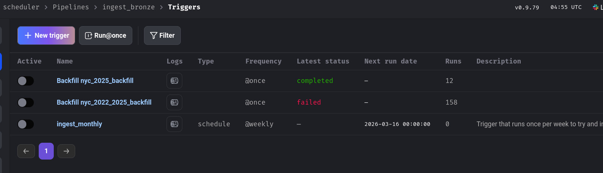

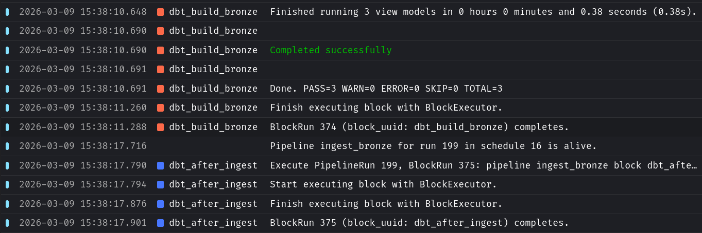


2. `dbt_after_ingest` (Trigger Pipeline): se activa automáticamente como bloque al final de `ingest_bronze` cuando este pipeline finaliza con éxito. Dispara en cadena el pipeline `dbt_build_silver`. Importante mencionar que este último se ejecuta como parte del modelo dbt de cada uno de los bloques a forma de `schema.yml`.

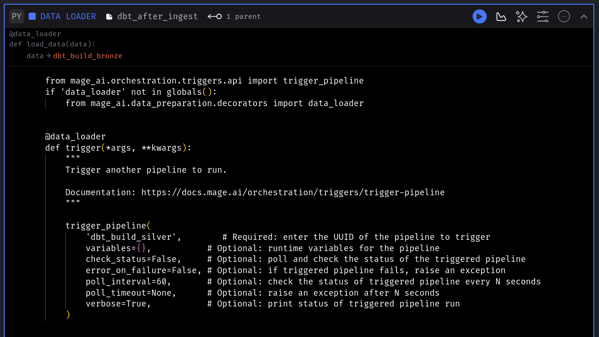

3. `dbt_trigger_gold` (Trigger Pipeline): al igual que el trigger anterior, este trigger funciona como un bloque dentro del pipeline `dbt_build_silver` que dispara al final de su ejecución el pipeline de `dbt_build_gold` automáticamente a penas termine correctamente su ejecución.

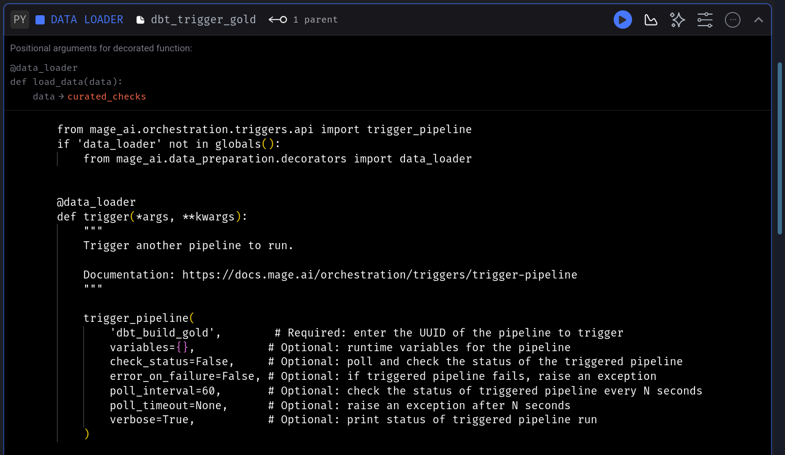

### Gestión de secretos

Siguiendo buenas prácticas de seguridad, ninguna credencial importante se encuentra directamente plasmada dentro del código. En su defecto, se encuentra dentro de un archivo `.env` para el caso del docker compose como se explicó anteriormente, o se encuentran configuradas como secretos dentro de **Mage Secrets**:

```text
- POSTGRES_USER: Usuario administrador de la base de datos destino.

- POSTGRES_PASSWORD: Contraseña para la conexión a PostgreSQL.

- POSTGRES_DB: Nombre de la base de datos del Data Warehouse.

- POSTGRES_HOST: Host de conexión (el nombre del contenedor en la red de Docker).

- POSTHRES_PORT: Puerto de la conexión con la base de datos PostgreSQL (5432 por defecto).
```

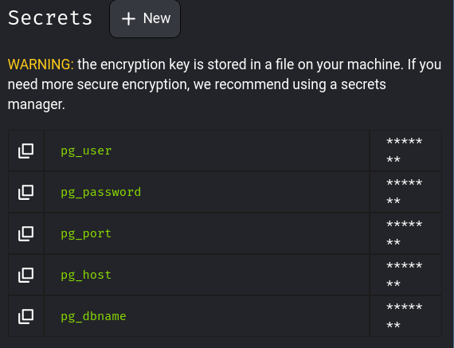

### Particionamiento en PostgreSQL

Con objetivo de optimizar el rendimiento analítico, la capa Gold implementa particionamiento declarativo nativo:

- `fct_trips`: particionamiento por `RANGE(pickup_date_key)` de forma mensual.
- `dim_zone`: particionamiento por `HASH(zone_key)` para 4 particiones.
- `dim_service_type`: particionamiento por `LIST(service_name)` para ('yellow','green').
- `dim_payment_type`: particionamiento por `LIST(payment_type_key)` para los keys (0, 1, 2, 3, 4, 5, 6), donde 0 = Flex Fair, 1 = Cash, 2 = Credit Card, 3 = No charge, 4 = Dispute, 5 = Unknown y 6 = Voided Trip.

#### Evidencias de particionamiento (`\d+`)

- fct_trips

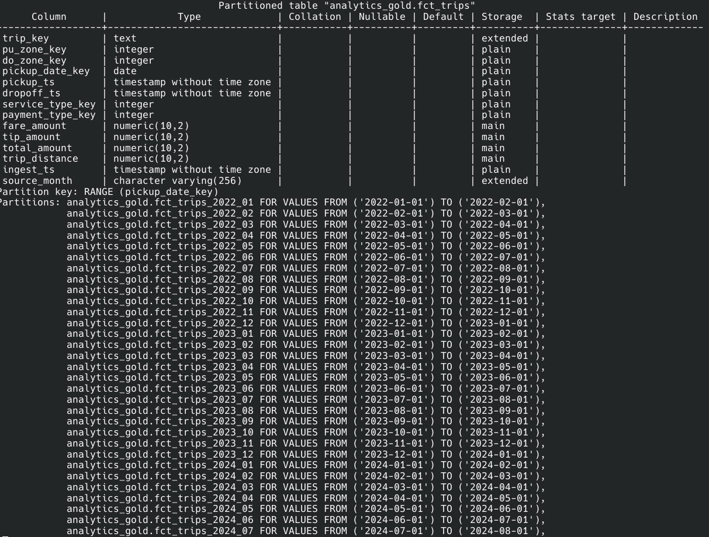

- dim_zone

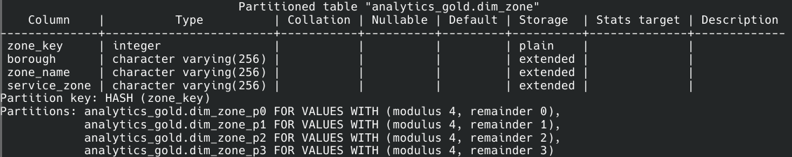

- dim_payment_type

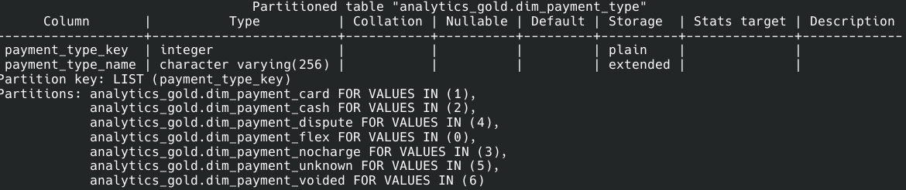

- dim_service_type

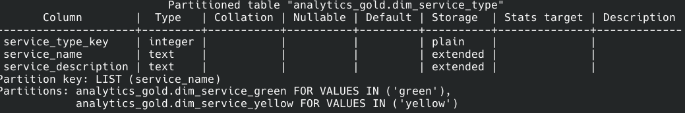

### Evidencias del Partition Pruning

- fct_trips por `pickup_date_key`

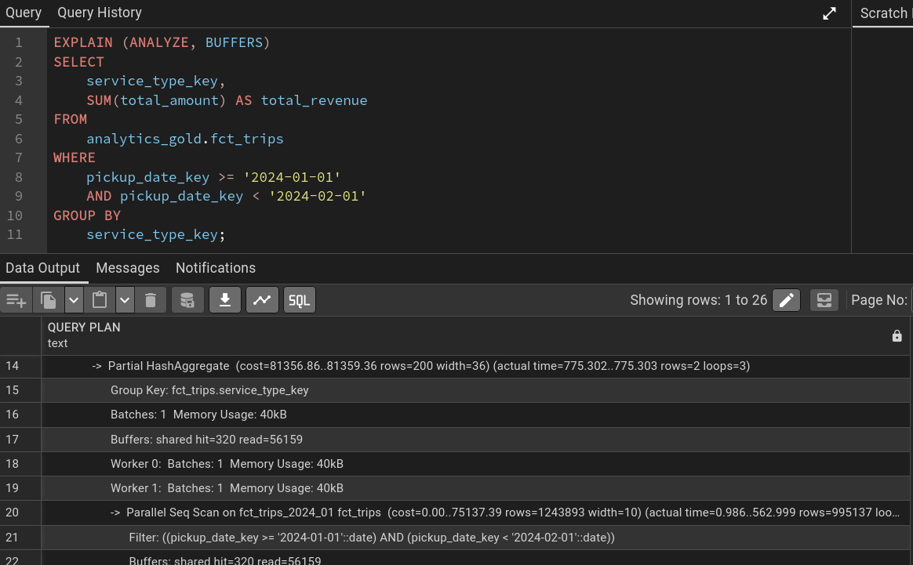

- dim_zone por `zone_key`

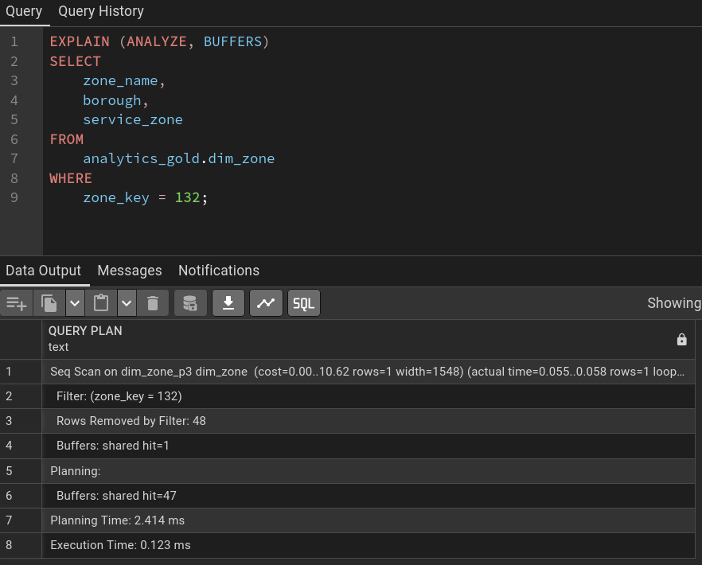

En ambos casos, nos dirigimos a observar la línea que empieza por **Seq Scan...**, donde se puede observar como el motor de PostgreSQL realiza el pruning de las particiones que no compete a la query actual y busca directamente en la tabla particionada donde sabe que encontrará la información solicitada.

### Transformaciones DBT

En cada pipeline `dbt`, se ejecutan comandos de `dbt run` y `dbt test`, tal que permita materializar las tablas (vistas en caso de silver) y se ejecuten las pruebas de calidad mínimas para cada uno de los casos. Para el caso de Gold, se ejecuta un DDL para creación y particionamiento de las tablas, el modelo de construcción y población de dichas tablas con `dbt run` y luego las `quality_checks` con `dbt test`.

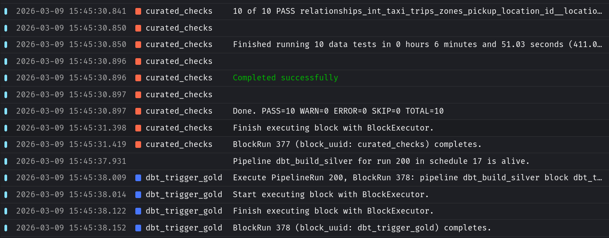


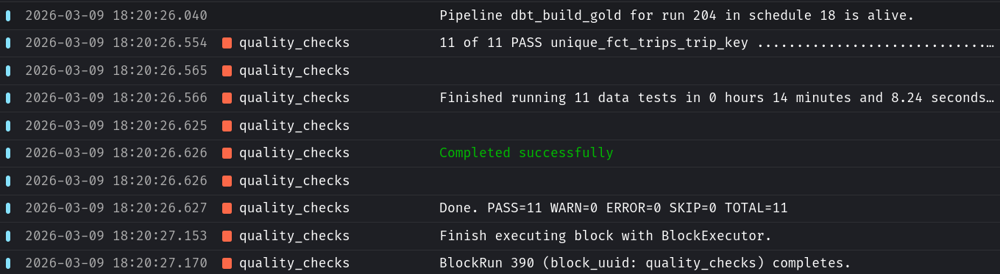

### Respuestas a preguntas de negocios

Se incluye el archivo `data_analysis.ipynb` con las queries utilizadas para la capa gold con las respuestas y breves explicaciones a las preguntas de negocio solicitadas.

### Troubleshooting

Durante el desarrollo se identificaron y solucionaron los siguientes problemas:

1. Error de caída de partición en dbt:

**Problema:** dbt intentaba ejecutar ALTER TABLE DROP COLUMN en las columnas usadas como llaves de partición, provocando un error fatal en PostgreSQL.

**Solución:** Se identificó que esto ocurría por un desajuste sutil de tipos de datos. Se ajustó el modelo dbt forzando un casting explícito (ej. ::VARCHAR(10)) para que coincidiera exactamente con el DDL de la tabla física, evitando que dbt intentara recrear la columna.

2. El "Empty Table NULL Trap" en modelos incrementales:

**Problema:** La inserción incremental arrojaba 0 registros porque la comparación MAX(ingest_ts) evaluaba a NULL en una tabla vacía.

**Solución:** Se incorporó la función COALESCE(MAX(ingest_ts), '1900-01-01') en la condición WHERE del modelo dbt para proveer una fecha por defecto en la primera carga.

3. Data Leakage con las fechas de los archivos Parquet:

**Problema:** Un constraint tipo CHECK en la tabla de hechos Gold fallaba porque los archivos fuente mensuales a menudo traían registros "rezagados" del mes anterior, rompiendo la partición lógica.

**Solución:** Se implementó una regla de calidad en la vista Silver (WHERE TO_CHAR(pickup_ts, 'YYYY-MM') = source_month) para poner en cuarentena los registros anómalos antes de que llegaran a la capa Gold.

### Checklist de aceptación

- [x] Docker Compose levanta Postgres + Mage
- [x] Credenciales en Mage Secrets y .env (solo .env.example en repo)
- [x] Pipeline ingest_bronze mensual e idempotente + tabla de cobertura
- [x] dbt corre dentro de Mage: dbt_build_silver, dbt_build_gold, quality_checks
- [x] Silver materialized = views; Gold materialized = tables
- [x] Gold tiene esquema estrella completo
- [x] Particionamiento: RANGE en fct_trips, HASH en dim_zone, LIST en dim_service_type y dim_payment_type
- [x] README incluye \d+ y EXPLAIN (ANALYZE, BUFFERS) con pruning
- [x] dbt test pasa desde Mage
- [x] Notebook responde 20 preguntas usando solo gold.*
- [x] Triggers configurados y evidenciados